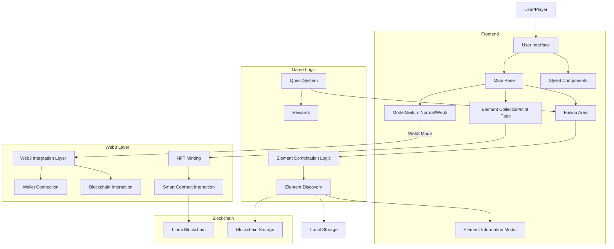
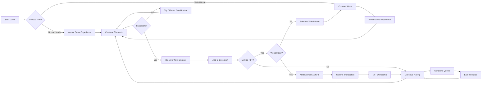
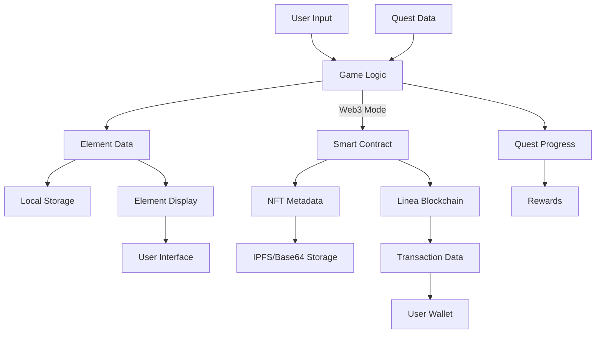

# ElementFusion Flow Diagrams

## Application Architecture

## User Journey Flow

## Data Flow

# ElementFusion - Improvement Ideas

## Linea-Specific Enhancements

1. **Linea zkEVM Integration**: Leverage Linea's zkEVM capabilities to create more complex and secure element combinations with zero-knowledge proofs, ensuring the integrity of rare element discoveries.

2. **Cross-Chain Element Bridge**: Develop functionality to bridge elements to other networks as NFTs, showcasing Linea's interoperability while expanding the game's ecosystem.

3. **Linea Learn & Earn**: Implement educational quests specifically about Linea technology, zkRollups, and Ethereum scaling that reward players with exclusive NFTs or tokens.

4. **Linea Ecosystem Integration**: Create partnerships with other Linea projects to develop special fusion elements representing the broader Linea ecosystem.

## Gameplay Enhancements

5. **Dynamic Element Properties**: Implement elements that change properties based on blockchain conditions (time of day, gas prices, network activity).

6. **Collaborative Discovery**: Allow multiple players to combine their elements for discovering ultra-rare compounds, encouraging community collaboration.

7. **Element Evolution**: Create a system where elements can evolve over time based on usage, interactions, or external factors.

8. **Seasonal Events**: Implement time-limited events featuring special elements related to Linea milestones and achievements.

## Technical Innovations

9. **On-Chain Achievements**: Store player achievements directly on Linea for verifiable gameplay milestones that can be displayed across platforms.

10. **Dynamic NFT Evolution**: Develop elements that evolve based on community interaction and usage, leveraging Linea's efficient transaction costs.

11. **Decentralized Element Governance**: Implement community voting on new element additions and game mechanics through a DAO structure.

12. **AI-Enhanced Element Creation**: Use AI to generate new element combinations and properties based on player behavior and preferences.

## Economic Model Improvements

13. **Element Marketplace**: Create a dedicated marketplace for trading discovered elements as NFTs with low fees thanks to Linea's cost efficiency.

14. **Tokenomics Integration**: Introduce a utility token for the ElementFusion ecosystem that powers in-game actions and governance.

15. **Staking Mechanism**: Allow players to stake their rarest elements to earn passive rewards and unlock special features.

16. **Play-to-Earn Model**: Implement a sustainable play-to-earn model where skilled players can earn rewards through gameplay and element discovery.

## User Experience Enhancements

17. **Mobile-Optimized Experience**: Develop a fully responsive mobile version to expand the player base.

18. **Social Features**: Add friend lists, element gifting, and collaborative challenges to enhance community engagement.

19. **3D Element Visualization**: Upgrade the visual representation of elements with 3D models and animations.

20. **Accessibility Improvements**: Ensure the game is accessible to players with different abilities through customizable interfaces and alternative interaction methods.