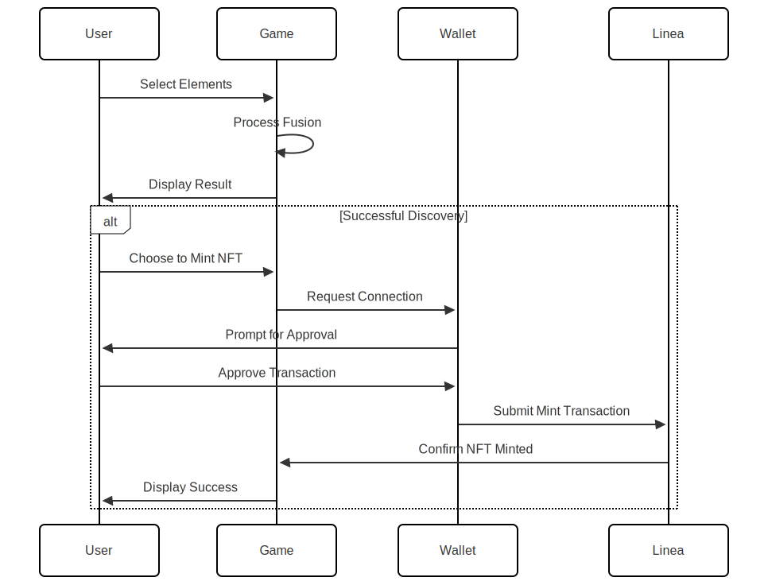

# ElementFusion

<p align="center">
  
</p>

<div align="center">
   
  <strong>Built for and deployed on Linea Mainnet</strong> 
  
</div>

## 🌟 Project Overview

ElementFusion is an innovative blockchain-based educational game that combines science, strategy, and NFT technology on the Linea network. Players discover and create new compounds by fusing basic elements, with special emphasis on Web3 and blockchain concepts, particularly those related to the Linea ecosystem.

The game features both Normal and Web3 modes, with the Web3 mode specifically highlighting blockchain concepts and Linea-specific elements, creating an engaging way for users to learn about the Linea ecosystem while playing.

[**Website**](https://www.elementfusion.tech/) | [**Demo Video**](https://www.youtube.com/watch?v=5x11q2aGXpc)

## 🔥 Why Linea?

ElementFusion has been specifically optimized for and deployed on the Linea network for several key reasons:

- **Scalability**: Linea's Layer 2 scaling solution provides fast and cost-effective transactions, essential for a smooth gaming experience with NFT minting.
- **EVM Compatibility**: Full compatibility with the Ethereum Virtual Machine allows seamless deployment of our smart contracts.
- **Low Gas Fees**: Affordable transaction costs make NFT minting accessible to all players.
- **Security**: Leveraging Ethereum's security while benefiting from Linea's performance improvements.
- **Educational Value**: The game introduces players to Linea-specific concepts through gameplay, helping to educate users about the Linea ecosystem.

## 🎮 Game Features

### Core Gameplay
- **Element Fusion**: Combine elements to discover over 700 unique compounds
- **Dual Game Modes**: 
  - **Normal Mode**: Focus on scientific elements and compounds
  - **Web3 Mode**: Discover blockchain concepts with special emphasis on Linea-specific elements
- **Educational Content**: AI-powered explanations of scientific and blockchain concepts

### Blockchain Integration
- **NFT Minting**: Mint discovered elements as NFTs on the Linea network
- **Rarity System**: Elements have different rarity levels affecting mint costs and collectibility
- **Linea-Specific Elements**: Special elements related to the Linea ecosystem, including:
  - **Linea**: Created by combining Ethereum and Layer 2
  - **eFrog**: Created by combining NFT and Linea
  - **zkEVM**: Created by combining Linea and EVM
  - **Layer 2 Bridge**: Created by combining Linea and Bridge

### Game Systems
- **Quest System**: Daily, weekly, monthly, and yearly challenges
- **Hint System**: Cost-based hints to help players when stuck
- **Element Rating**: Community-driven rarity adjustments

## 🔍 Technical Architecture




### User Flow




## 🛠️ Technology Stack

- **Frontend**: Next.js, React, Chakra UI
- **Styling**: Tailwind CSS, Styled Components
- **Blockchain Integration**: wagmi, RainbowKit
- **Smart Contracts**: Solidity (deployed on Linea Mainnet)
- **NFT Storage**: IPFS via Pinata
- **AI Integration**: OpenAI for element explanations

## 📊 Linea Smart Contract

- **Contract Address**: [0x03E24DD2c106fe5E4a28E1CdedDE372E38C6960A](https://lineascan.build/address/0x03E24DD2c106fe5E4a28E1CdedDE372E38C6960A#code)
- **Features**:
  - ERC-721 NFT implementation
  - Rarity-based minting costs
  - Metadata storage with element attributes

## 🚀 Getting Started

### Prerequisites
- Node.js (v14 or higher)
- npm or yarn
- MetaMask or another Web3 wallet with Linea network configured

### Installation

1. Clone the repository:
   ```bash
   git clone https://github.com/L-KH/ElementFusion.git
   cd ElementFusion
   ```

2. Install dependencies:
   ```bash
   npm install
   ```

3. Create a `.env` file based on `.env.example`:
   ```
   NEXT_PUBLIC_WALLETCONNECT_PROJECT_ID=your_project_id
   ```

4. Run the development server:
   ```bash
   npm run dev
   ```

5. Open [http://localhost:3000](http://localhost:3000) in your browser

## 💡 Innovative Ideas for Future Development

### Linea-Specific Enhancements

1. **Linea Learn & Earn**: Educational quests specifically about Linea that reward players with exclusive NFTs or tokens

2. **Linea Ecosystem Integration**: Partnerships with other Linea projects to create special fusion elements representing the broader Linea ecosystem

3. **Cross-Chain Element Bridge**: Allow elements to be bridged to other networks, showcasing Linea's interoperability

### Gameplay Enhancements

4. **Multiplayer Fusion Labs**: Collaborative element discovery with other players on the Linea network

5. **Element Marketplace**: A dedicated marketplace for trading discovered elements as NFTs with low fees thanks to Linea

6. **Seasonal Events**: Time-limited events featuring special elements related to Linea milestones and achievements

### Technical Innovations

7. **On-Chain Achievements**: Store player achievements directly on Linea for verifiable gameplay milestones

8. **Dynamic NFT Evolution**: Elements that evolve based on community interaction and usage

9. **Decentralized Element Governance**: Community voting on new element additions and game mechanics

## 👨‍💻 Team

Lahcen KH - Creator & Developer

## 📄 License

This project is licensed under the MIT License - see the LICENSE.md file for details.